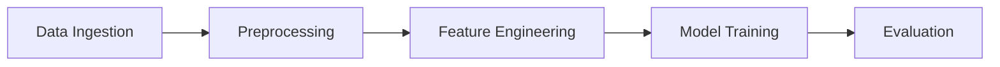

mlops-mini-project
==============================

a small mlops project

Project Organization
------------

    ├── LICENSE
    ├── Makefile           <- Makefile with commands like `make data` or `make train`
    ├── README.md          <- The top-level README for developers using this project.
    ├── data
    │   ├── external       <- Data from third party sources.
    │   ├── interim        <- Intermediate data that has been transformed.
    │   ├── processed      <- The final, canonical data sets for modeling.
    │   └── raw            <- The original, immutable data dump.
    │
    ├── docs               <- A default Sphinx project; see sphinx-doc.org for details
    │
    ├── models             <- Trained and serialized models, model predictions, or model summaries
    │
    ├── notebooks          <- Jupyter notebooks. Naming convention is a number (for ordering),
    │                         the creator's initials, and a short `-` delimited description, e.g.
    │                         `1.0-jqp-initial-data-exploration`.
    │
    ├── references         <- Data dictionaries, manuals, and all other explanatory materials.
    │
    ├── reports            <- Generated analysis as HTML, PDF, LaTeX, etc.
    │   └── figures        <- Generated graphics and figures to be used in reporting
    │
    ├── requirements.txt   <- The requirements file for reproducing the analysis environment, e.g.
    │                         generated with `pip freeze > requirements.txt`
    │
    ├── setup.py           <- makes project pip installable (pip install -e .) so src can be imported
    ├── src                <- Source code for use in this project.
    │   ├── __init__.py    <- Makes src a Python module
    │   │
    │   ├── data           <- Scripts to download or generate data
    │   │   └── make_dataset.py
    │   │
    │   ├── features       <- Scripts to turn raw data into features for modeling
    │   │   └── build_features.py
    │   │
    │   ├── models         <- Scripts to train models and then use trained models to make
    │   │   │                 predictions
    │   │   ├── predict_model.py
    │   │   └── train_model.py
    │   │
    │   └── visualization  <- Scripts to create exploratory and results oriented visualizations
    │       └── visualize.py
    │
    └── tox.ini            <- tox file with settings for running tox; see tox.readthedocs.io


--------

<p><small>Project based on the <a target="_blank" href="https://drivendata.github.io/cookiecutter-data-science/">cookiecutter data science project template</a>. #cookiecutterdatascience</small></p>


#  Commands and About the project:

## End-to-End Flow: DVC, MLflow, DagsHub, Flask, and CI/CD

### 15. Run the DVC Pipeline and Promote the Model
Use `dvc repro` to execute the pipeline, which will train and evaluate your model. The model and its metrics are logged to DagsHub via MLflow. **DagsHub does not support the MLflow Model Registry.** Instead, the best model is promoted by tagging the MLflow run as `model_status=production`.

### 16. Deploy with Flask and Download Model from DagsHub
Create a Flask app for inference. The app should use the MLflow API to search for the latest run tagged as `model_status=production` and load the model artifact from that run:
```python
import mlflow
client = mlflow.tracking.MlflowClient()
experiment = mlflow.get_experiment_by_name("dvc-pipeline")
runs = client.search_runs(
    experiment_ids=[experiment.experiment_id],
    filter_string="tags.model_status = 'production'",
    order_by=["attributes.start_time DESC"],
    max_results=1
)
if not runs:
    raise Exception("No production model found.")
run_id = runs[0].info.run_id
model_uri = f"runs:/{run_id}/model"
model = mlflow.pyfunc.load_model(model_uri)
```
This ensures your app always uses the latest production model.

### 17. CI Pipeline: Automate DVC Pipeline via GitHub Actions
To automate the DVC pipeline in CI, add a step in your `.github/workflows/ci.yaml`:
```yaml
- name: Run DVC pipeline
  env:
    DAGSHUB_PAT: ${{ secrets.DAGSHUB_PAT }}
  run: dvc repro
```
This ensures your pipeline runs on every push, using a secure token for authentication.

### 18. Secure Authentication with DagsHub Token
Instead of manual authentication, use a DagsHub Personal Access Token (PAT) as a GitHub Actions secret:
1. Generate a PAT from your DagsHub account.
2. In your GitHub repo, go to **Settings > Secrets and variables > Actions > New repository secret**.
3. Name it `DAGSHUB_PAT` and paste your token.

### 19. Update Your Code for CI Authentication
In your Python code, use the following to authenticate with DagsHub/MLflow:
```python
import os
dagshub_token = os.getenv("DAGSHUB_PAT")
if not dagshub_token:
    raise EnvironmentError("DAGSHUB_PAT environment variable is not set")
os.environ["MLFLOW_TRACKING_USERNAME"] = dagshub_token
os.environ["MLFLOW_TRACKING_PASSWORD"] = dagshub_token
```
This allows your pipeline and MLflow logging to work seamlessly in CI/CD environments.

---

### Project Setup Commands
```bash
# 1. Create project template
pip install cookiecutter
cookiecutter https://github.com/drivendata/cookiecutter-data-science
# Fill project details: tweet_emotion_classification

# 2. Cleanup template
cd tweet_emotion_classification
rm -rf data/external/* data/raw/* references/*

# 3. Initialize Git
git init
git add .
git commit -m "Initial project structure"

# 4. Create GitHub repo & push
gh repo create tweet_emotion_classification --public --push --source .
```

### DagsHub Setup (After creating repo on dagshub.com)
```bash
# 5. Configure MLflow tracking
cat > notebooks/dagshub_setup.py <<EOF
import os
import dagshub
import mlflow

dagshub.init(
    repo_owner="<YOUR_USERNAME>", 
    repo_name="tweet_emotion_classification",
    mlflow=True
)
mlflow.set_tracking_uri(os.environ['MLFLOW_TRACKING_URI'])
EOF

# Install dependencies
pip install dagshub mlflow
```

### DVC Pipeline Implementation
```bash
# 9-10. Initialize DVC & configure remote
dvc init
dvc remote add -d myremote s3://your-bucket/dvc-storage

# 11. Create pipeline stages
dvc stage add -n data_ingestion \
    -d src/data_ingestion.py -d data/raw \
    -o data/processed/ingested.csv \
    python src/data_ingestion.py

dvc stage add -n preprocessing \
    -d src/preprocessing.py -d data/processed/ingested.csv \
    -o data/processed/cleaned.csv \
    python src/preprocessing.py

dvc stage add -n feature_engineering \
    -d src/feature_engineering.py -d params.yaml \
    -d data/processed/cleaned.csv \
    -o data/features/features.csv \
    python src/feature_engineering.py

dvc stage add -n train \
    -d src/train.py -d data/features/features.csv \
    -o models/model.joblib \
    python src/train.py

dvc stage add -n evaluate \
    -d src/evaluate.py -d models/model.joblib \
    -o metrics/performance.json \
    python src/evaluate.py

# 12. Run pipeline
dvc repro
```

### AWS S3 Configuration
```bash
# 14. Configure AWS
pip install dvc-s3
aws configure
# Enter credentials when prompted

# Add data storage
dvc remote modify myremote endpointurl https://s3.amazonaws.com
dvc add data/raw
dvc push
```

## Storing DVC Data in AWS S3 using AWS CLI

To store your DVC-tracked data in an AWS S3 bucket, follow these steps:

### 1. Install and Configure AWS CLI
```bash
pip install awscli  # or use your OS package manager
aws configure
# Enter your AWS Access Key, Secret Key, region, and output format when prompted
```

### 2. Install DVC S3 Support
```bash
pip install dvc_s3
```

### 3. Initialize DVC (if not already done)
```bash
dvc init
```

### 4. Add S3 as a DVC Remote
```bash
dvc remote add -d myremote s3://<your-bucket-name>
# Example: dvc remote add -d myremote s3://aws-mlops-mini-project
```

### 5. (Optional) Set S3 Endpoint URL (for custom endpoints)
```bash
dvc remote modify myremote endpointurl https://s3.amazonaws.com
```

### 6. Track and Push Data
```bash
dvc add <data-or-model-file>
dvc push
```

### 7. Typical Workflow Example
```bash
# Reproduce pipeline and push tracked files to S3
dvc repro
dvc push
```

### 8. Example Command History
```
dvc init
dvc status
dvc repro
aws configure
dvc remote add -d myremote s3://aws-mlops-mini-project
dvc repro
dvc status
git status
git add params.yaml dvc.lock
dvc status
dvc push
pip install dvc_s3
dvc push
```

This will ensure your DVC-tracked data and models are stored in your S3 bucket, making them accessible for collaboration and reproducibility.
```

---

## Comprehensive README.md

````markdown
# Tweet Emotion Classification

## Project Overview
Classify tweet emotions using NLP techniques and ML algorithms. Implements:
- BoW/TF-IDF feature extraction
- Logistic Regression/RandomForest/XGBoost
- Hyperparameter tuning
- DVC pipeline
- MLflow experiment tracking

## Project Structure
```
├── data
│   ├── raw              - Raw tweet data
│   ├── processed        - Cleaned data
│   └── features         - Engineered features
├── models               - Trained models
├── notebooks            - Experiment notebooks
├── flask-api
│   ├── app.py
│   └── preprocessing_utility.py
├── src
│   ├── data_ingestion.py
│   ├── preprocessing.py
│   ├── feature_engineering.py
│   ├── train.py
│   └── evaluate.py
├── params.yaml          - Pipeline parameters
├── dvc.yaml             - DVC pipeline
└── requirements.txt
```

## Setup
```bash
git clone https://github.com/<username>/tweet_emotion_classification.git
cd tweet_emotion_classification
pip install -r requirements.txt
```

## Data Pipeline


### Run Pipeline
```bash
dvc repro  # Execute full pipeline
dvc metrics show  # View performance metrics
```

## Experiment Tracking
1. **Baseline Model (Exp1)**: 
   - BoW + Logistic Regression
   - `notebooks/exp1-baseline.ipynb`
   
2. **Feature Comparison (Exp2)**:
   - Compare BoW vs TF-IDF
   - Multiple algorithms
   - `notebooks/exp2-feature-comparison.ipynb`
   
3. **Hyperparameter Tuning (Exp3)**:
   - Optimize best model
   - `notebooks/exp3-hyperparameter-tuning.ipynb`

View experiments on [DagsHub](https://dagshub.com/<username>/tweet_emotion_classification)

## Deployment
```python
# app.py
from flask import Flask
import joblib

app = Flask(__name__)
model = joblib.load('models/model.joblib')

@app.post('/predict')
def predict():
    text = request.json['text']
    # Preprocessing logic
    prediction = model.predict([text])
    return {'emotion': prediction[0]}
```

Run with:
```bash
python app.py
```

## DVC Configuration
```bash
# Add data storage
dvc remote add -d myremote s3://your-bucket/dvc-storage

# Pull data
dvc pull
```

## Contributors
[Your Name]
````

### Key Implementation Notes:
1. **Experiment Workflow**:
   - Exp1: Baseline with BoW + LogisticRegression
   - Exp2: Compare feature extraction methods (BoW vs TF-IDF) with multiple classifiers
   - Exp3: Hyperparameter tuning for best combination

2. **DVC Pipeline**:
   - Use `params.yaml` for all configurable parameters
   - MLflow logging integrated in `evaluate.py`:
     ```python
     import mlflow
     mlflow.log_metrics({"f1": f1_score})
     mlflow.log_artifact("models/model.joblib")
     ```

3. **Model Serving**:
   - Fetch production model from DagsHub:
     ```python
     import dagshub
     dagshub.content.get_model("model.joblib", path="models/production")
     ```

4. **Requirements.txt**:
   ```
   scikit-learn==1.2.2
   pandas==2.0.3
   numpy==1.24.3
   dvc[s3]==3.0.0
   mlflow==2.4.1
   dagshub==0.3.14
   flask==2.3.2
   nltk==3.8.1
   xgboost==1.7.5
   ```

This setup provides complete reproducibility from experimentation to deployment with DVC pipeline management and MLflow tracking through DagsHub.

------------------------
# Now we will deploy our model in EC2 instance via docker hub using github action workflow

## Docker, Docker Hub, and EC2 Deployment with CI/CD

### 1. Docker Hub Authentication and GitHub Secrets
- Create a Docker Hub access token with read/write permissions.
- Add the following secrets to your GitHub repository:
  - `DOCKER_USERNAME`: your Docker Hub username
  - `DOCKER_PASSWORD`: your Docker Hub access token
  - `DAGSHUB_PAT`: your DagsHub token (for model access)
  - `EC2_HOST`: your EC2 public DNS or IP
  - `EC2_USER`: the username for your EC2 instance (e.g., `ubuntu`)
  - `EC2_SSH_KEY`: your EC2 private SSH key (as a secret)
  - `EC2_PORT`: SSH port (default is 22)

### 2. CI/CD Pipeline Steps (in GitHub Actions)
1. Push code to GitHub.
2. The pipeline will:
   - Build and push the Docker image to Docker Hub.
   - Run the DVC pipeline, generate and tag the model as production, and push to DagsHub.
   - Run model and Flask app tests.
   - Deploy the Docker image to your EC2 instance using SSH.

Example workflow steps:
```yaml
- name: Push Docker image to Docker Hub
  if: success()
  run: |
    docker push ${{ secrets.DOCKER_USERNAME }}/emotion2:latest

- name: Deploy to EC2
  if: success()
  uses: appleboy/ssh-action@v0.1.8
  with:
    host: ${{ secrets.EC2_HOST }}
    username: ${{ secrets.EC2_USER }}
    key: ${{ secrets.EC2_SSH_KEY }}
    port: ${{ secrets.EC2_PORT }}
    script: |
      docker pull ${{ secrets.DOCKER_USERNAME }}/emotion2:latest
      docker stop my-app || true
      docker rm my-app || true
      docker run -d -p 80:5000 --name my-app \
        -e DAGSHUB_PAT=${{ secrets.DAGSHUB_PAT }} \
        ${{ secrets.DOCKER_USERNAME }}/emotion2:latest
```

### 3. Manual EC2 Setup (one-time)
SSH into your EC2 instance and run:
```bash
sudo apt-get update
sudo apt-get install -y docker.io
sudo systemctl start docker
sudo systemctl enable docker
sudo docker pull <your-docker-username>/emotion2:latest
```
To run the container manually:
```bash
sudo docker run -p 8888:5000 -e DAGSHUB_PAT=<your-dagshub-pat> <your-docker-username>/emotion2:latest
```
- Make sure your EC2 security group allows inbound traffic on the port you expose (e.g., 8888 or 80).
- Access the app via your EC2 public DNS and the chosen port.

### 4. (Optional) Avoid Using `sudo` for Docker
On EC2, add your user to the docker group:
```bash
sudo usermod -aG docker ubuntu
```
Log out and log back in for the change to take effect.

### 5. CI/CD Deployment Integration
- The GitHub Actions workflow will automatically deploy the latest Docker image to EC2 after a successful build and test.
- Ensure all required secrets are set in your GitHub repository.
- The deployment step will pull, stop, remove, and run the new container as `my-app`.

